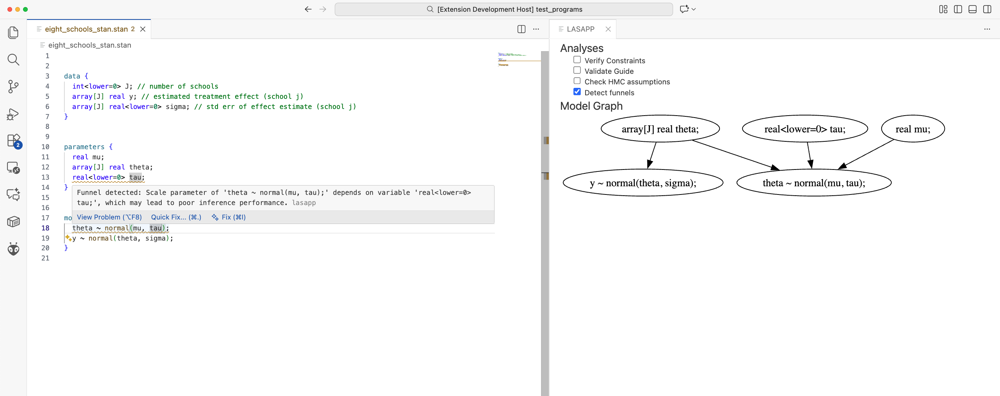

# LASAPP VSCode Extension



## Installation
```
npm install -g @vscode/vsce
vsce package
```
This builds `lasapp-1.0.0.vsix`.

Then, navigate in VSCode to extensions and select "Install from VSIX".
Select `lasapp-1.0.0.vsix`.

### Requirements to use Backends

- Python
  - Python 3.11
  - [Python VSCode Extension](https://marketplace.visualstudio.com/items?itemName=ms-python.python)
- Julia
  - Julia 1.9
  - [Julia VSCode Extension](https://marketplace.visualstudio.com/items?itemName=julialang.language-julia)
- Stan
  - [Stan VSCode Extension](https://marketplace.visualstudio.com/items?itemName=ivan-bocharov.stan-vscode)
https://github.com/markus7800/stanc3
  - Modified `stanc` parser. Build from [here](https://github.com/markus7800/stanc3) and set `lasapp.stanc.path` setting to path to `stanc.exe` binary. This parser is modified to provide code location information to the analysis.

